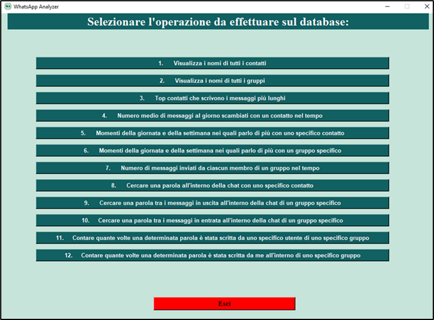
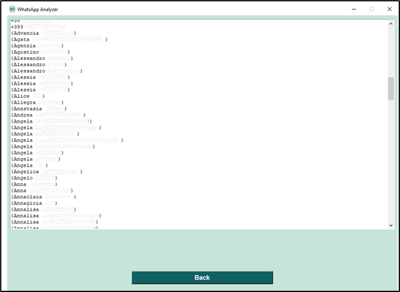
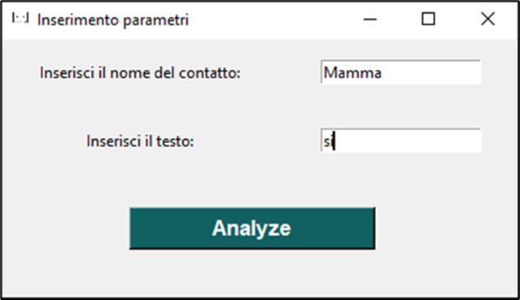
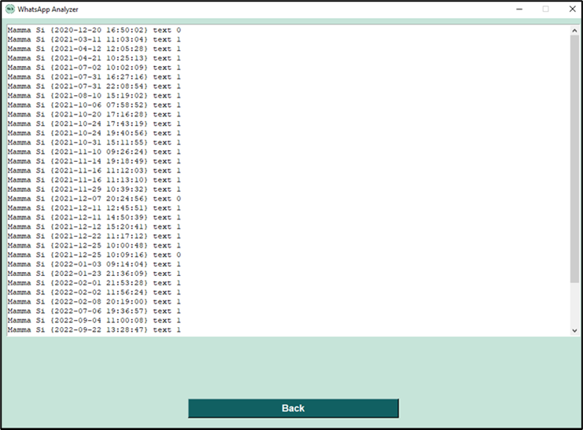

# Whatsapp-Analyzer
WhatsApp analyzer is a tool that allows you to scrape whatsapp chats using the filters it contains, after having extracted the database.
WhatsApp analyzer è un tool che permette di effettuare uno scraping delle chat di whatsapp utilizzando i filtri in esso contenuto, dopo averne estratto il database. 

Lavoro di tesi magistrale in Sicurezza Informatica. <br>

### Note <br>
- Nel repository non è presente il database utilizzato per il caso di studio, essendo strettamente personale. <br>
- Tutti i riferimenti a persone, gruppi e contatti sono stati oscusati per privacy.

## Indice
1. [Prerequisiti](#prerequisiti)
2. [Estrazione database IOS](#estrazione-database-IOS)
3. [Estrazione database Android](#estrazione-database-Android)
4. [Creazione viste](#creazione-viste)
5. [Query utilizzate](#query-utilizzate)
6. [Istruzioni per l'avvio](#istruzioni-per-l'avvio)
7. [Funzionamento del tool](#funzionamento-del-tool)


## 1. Prerequisiti 

- Imobax: https://github.com/Siguza/imobax
- DB Broswer for SQLite (per creare le query): https://sqlitebrowser.org/dl/
- BlueStacks App Player (emulatore Android)
- X-plore File Manager: https://play.google.com/store/apps/details?id=com.lonelycatgames.Xplore&hl=it&gl=US
- Root Checker (per verificare i permessi di root): https://play.google.com/store/apps/details?id=com.joeykrim.rootcheck&hl=it&gl=US
- Wa-crypt-tool (per aprire il database con la key): https://github.com/ElDavoo/wa-crypt-tools
- Python (linguaggio utilizzato per lo svilippo del tool)
- PyCharm (ambiente di sviluppo)
- Tkinter (per la grafica)

## 2. Estrazione del database IOS

- Effettuare il backup di iPhone tramite iTunes. <br>
- Il backup presente al percorso *%userprofile%\Apple\MobileSync\Backup* è crittografato. <br>
- Utilizzare il tool Imobax per scoprire quali dei file è il database di WhatsApp Messenger.

## 3. Estrazione del database Android

- Effettuare il backup dei messaggi di WhatsApp Messenger. <br>
- Ho bisogno di un dispositivo con permessi di root. Ho usato un dispositivo emulato con BlueStacks App Player. <br>
- Uso l'app X-plore per accedere ad aree riservate del dispositivo, recuperando il database e la key di WhatsApp Messenger.


## 4. Creazione viste

Creo due viste all’interno del database: una per i messaggi privati, individuali, che chiamo *friends_messages* e un’altra per i messaggi delle chat di gruppo che chiamo *group_messages*. <br>

**Vista friend_messages**: <br>
```
create view friend_messages as
select
ZWACHATSESSION.ZPARTNERNAME as friend_name,
ZWAMESSAGE.ZISFROMME as is_from_me,
(case
ZWAMESSAGE.ZISFROMME
when 0 then ZWAMESSAGE.ZFROMJID
else ZWAMESSAGE.ZTOJID
end) as friend_number,
(case
ZWAMESSAGE.ZMESSAGETYPE
when 0 then 'text'
when 1 then 'image'
when 2 then 'video'
when 3 then 'voice_message'
when 4 then 'gif'
when 5 then 'location'
when 6 then 'group_event'
when 7 then 'hyperlink'
when 8 then 'document'
when 14 then 'deleted_message'
when 15 then 'sticker'
else 'unknown'
end) as message_type,
datetime(ZWAMESSAGE.ZMESSAGEDATE + 978307200, 'unixepoch') as message_date,
ZWAMESSAGE.ZTEXT as message_text
from
ZWACHATSESSION
INNER JOIN ZWAMESSAGE ON ZWACHATSESSION.ZCONTACTJID == friend_number
where
ZWACHATSESSION.ZSESSIONTYPE == 0
 ```
<br>

**vista group_messagess**:  <br>

```
create view group_messages as
select
ZWACHATSESSION.ZPARTNERNAME as group_name,
ZWAMESSAGE.ZISFROMME as is_from_me,
(case
ZWAMESSAGE.ZISFROMME
when 0 then ZWAMESSAGE.ZFROMJID
else ZWAMESSAGE.ZTOJID
end) as group_id,
(case
ZWAMESSAGE.ZMESSAGETYPE
when 0 then 'text'
when 1 then 'image'
when 2 then 'video'
when 3 then 'voice_message'
when 4 then 'gif'
when 5 then 'location'
when 6 then 'group_event'
when 7 then 'hyperlink'
when 8 then 'document'
when 14 then 'deleted_message'
when 15 then 'sticker'
else 'unknown'
end) as message_type,
datetime(ZWAMESSAGE.ZMESSAGEDATE + 978307200, 'unixepoch') as message_date,
ZWAMESSAGE.ZTEXT as message_text,
friend_chat_session.ZPARTNERNAME as friend_name,
ZWAGROUPMEMBER.ZMEMBERJID as friend_id
from
ZWACHATSESSION
INNER JOIN ZWAMESSAGE ON ZWACHATSESSION.ZCONTACTJID == group_id
LEFT JOIN ZWAGROUPMEMBER ON ZWAMESSAGE.ZGROUPMEMBER == ZWAGROUPMEMBER.Z_PK
LEFT JOIN ZWACHATSESSION as friend_chat_session ON ZWAGROUPMEMBER.ZMEMBERJID == friend_chat_session.ZCONTACTJID
where
ZWACHATSESSION.ZSESSIONTYPE == 1 
and message_type not in ('unknown', 'group_event');
 ```

## 5. Query utilizzate

Le prime tre query sono senza filtri. Tutte le altre presentano dei filtri. <br>
Segue l'elenco delle query create. <br>

**1. Visualizza i nomi di tutti i contatti** <br>
```
select ZPARTNERNAME from ZWACHATSESSION where ZSESSIONTYPE==0
order by ZPARTNERNAME;
```

**2. Visualizza i nomi di tutti i gruppi** <br>
```
select ZPARTNERNAME from ZWACHATSESSION where ZSESSIONTYPE==1
order by ZPARTNERNAME;
```

**3. Top contatti che scrivono i messaggi più lunghi** <br>
```
select
  friend_name,
  avg(length(message_text)) as avg_message_length
from
  friend_messages
where
  message_type == "text"
  and is_from_me == 0
group by
  friend_name
order by
  avg_message_length desc
```

**4. Numero medio di messaggi al giorno scambiati con un contatto nel tempo** <br>
```
select 
  day,
  avg(number_of_messages) over (
    order by
      day asc rows 30 preceding
  ) as ma_nom
from
  (
    SELECT
      date(message_date) as day,
      count(*) as number_of_messages
    from
      friend_messages
    where
      friend_name == "Mamma"
    group by
      day,
      friend_name
  )
```

**5. Momenti della giornata e della settimana nei quali parlo di più con uno specifico contatto** <br>
```
select
  
  strftime('%w', message_date) as weekday_number,
  (
    case
      strftime('%w', message_date)
      when '0' then 'Monday'
      when '1' then 'Tuesday'
      when '2' then 'Wednesday'
      when '3' then 'Thursday'
      when '4' then 'Friday'
      when '5' then 'Saturday'
      when '6' then 'Sunday'
      else 'unknown'
    end
  ) as weekday_name,
  strftime('%H', message_date) as day_hour,
  count(*) as number_of_messages
from
  friend_messages
where
  friend_name == 'Mamma'
group by
  weekday_name, day_hour
order by
  weekday_number, day_hour
```

**6. Momenti della giornata e della settimana nei quali parlo di più con un gruppo specifico** <br>
```
select
  
  strftime('%w', message_date) as weekday_number,
  (
    case
      strftime('%w', message_date)
      when '0' then 'Monday'
      when '1' then 'Tuesday'
      when '2' then 'Wednesday'
      when '3' then 'Thursday'
      when '4' then 'Friday'
      when '5' then 'Saturday'
      when '6' then 'Sunday'
      else 'unknown'
    end
  ) as weekday_name,
  strftime('%H', message_date) as day_hour,
  count(*) as number_of_messages
from
  group_messages
where
  group_name == 'ArgoTeam'
group by
  weekday_name, day_hour
order by
  weekday_number, day_hour
```

**7. Numero di messaggi inviati da ciascun membro di un gruppo nel tempo** <br>
```
select
  friend_name,
  day,
  avg(number_of_sent_messages) over (
    order by
      friend_name,
      day asc rows 30 preceding
  ) as ma_nom
from
  (
    select
      (
        case
          is_from_me
          when 0 then friend_name
          else 'Me'
        end
      ) as friend_name,
      date(message_date) as day,
      count(*) as number_of_sent_messages
    from
      group_messages
    where
      group_name == "ArgoTeam"
    group by
      friend_name,
      day
  );
```

**8. Cercare una parola all'interno della chat con uno specifico contatto** <br>
```
select  message_date,message_type, message_text, is_from_me

from friend_messages

where friend_name == "Mamma" AND
	message_text LIKE '%ok%'
```

**9. Cercare una parola tra i messaggi in uscita all'interno della chat di un gruppo specifico** <br>
```
select message_date,message_type, message_text

from group_messages

where group_name == "ArgoTeam" 
	AND is_from_me == 1
	AND message_text LIKE '%si%'
```

**10. Cercare una parola tra i messaggi in entrata all'interno della chat di un gruppo specifico** <br>
```
select message_date, message_type, message_text, friend_name, friend_id

from group_messages

where group_name == "ArgoTeam" 
	AND is_from_me == 0
	AND message_text LIKE '%si%'
```

**11. Contare quante volte una determinata parola è stata scritta da uno specifico utente di uno specifico gruppo** <br>

```
select count(*) as number_of_messages, friend_name, friend_id, group_name, group_id
from group_messages
where group_name == "ArgoTeam" 
	AND is_from_me == 0
	AND friend_name == 'Sara Uni'
	AND message_text LIKE '%si%'

```

**12. Contare quante volte una determinata parola è stata scritta da me all'interno di uno specifico gruppo** <br>

```
select count(*) as number_of_messages, group_name, group_id
from group_messages
where group_name == "ArgoTeam" 
	AND is_from_me == 1
	AND message_text LIKE '%si%'

```


## 6. Istruzioni per l'avvio 
<p> 1.  Scaricare il repository in locale o effettuare il clone con il comando: git clone
<p> 2.  Recarsi nella root folder Whatsapp-Analyzer </p>
<p> 2.  Inserire il database da analizzare "database.sqlite" all'interno della cartella del repository.
<p> 3.  Avviare il tool da terminale con il comando python main.py


## 7. Funzionamento del tool

All'avvio si apre questa pagina. Cliccare START per procedere. <br>
<p>  <br>

Sono mostrate all'utente tutte le query disponibili e selezionabili. <br>
<p>  <br>

Esempio di visualizzazione query senza filtro. Premo il pulsante 1. <br>
viene mostrato a video l'elenco di tutti i nomi dei contatti: <br>
<p>  <br>

Esempio di visualizzazione query con filtro (Ci sono query con 1, 2 o 3 filtri). Premo il pulsante 8. <br>
Compare la schermata di inserimento dei parametri, nella quale andranno specificati i parametri da utilizzare come filtro per la query, in questo caso contatto 'Mamma' e testo 'si' perchè si vuole cercare la parola “si” all’interno della chat con il contatto “Mamma”. <br><br>
*NOTA*: Se voglio che il testo 'si' sia contenuto all'interno di un altra parola andrà inserito in questo modo: %si% <br>
<p>  <br>
Il risultato è mostrato a video: <br>
<p>  <br>


