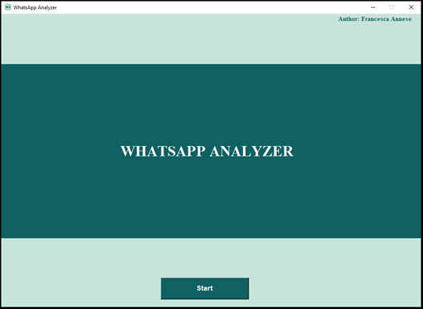

# Whatsapp-Analyzer
WhatsApp analyzer is a tool that allows you to scrape whatsapp chats using the filters it contains, after having extracted the database.
WhatsApp analyzer è un tool che permette di effettuare uno scraping delle chat di whatsapp utilizzando i filtri in esso contenuto, dopo averne estratto il database. 

Lavoro di tesi magistrale in Sicurezza Informatica. <br>

### Note <br>
- Effettuare l'estrazione del database di Whatsapp Messenger (i metodi per estrarre il database differiscono da IOS e Android) <br>
- Nel repository non è presente il database utilizzato per il caso di studio, essendo strettamente personale. <br>

## Indice
1. [Prerequisiti](#prerequisiti)
2. [Estrazione database IOS](#estrazione-database-IOS)
3. [Estrazione database Android](#estrazione-database-Android)
5. [Query utilizzate](#query-utilizzate)
6. [Istruzioni per l'avvio](#istruzioni-per-l'avvio)
7. [Funzionamento del tool](#funzionamento-del-tool)


## 1. Prerequisiti 

## 2. Estrazione del database IOS

- Effettuare il backup di iPhone tramite iTunes. <br>
- Il backup presente al percorso %userprofile%\Apple\MobileSync\Backup è crittografato. <br>
- Utilizzare il tool Imobax (https://github.com/Siguza/imobax) per scoprire quali dei file è il database di WhatsApp Messenger.

## 3. Estrazione del database Android

- Effettuare il backup dei messaggi di WhatsApp Messenger. <br>
- Ho bisogno di un dispositivo con permessi di root. Ho usato un dispositivo emulato con BlueStacks App Player. <br>
- Uso l'app X-plore per accedere ad aree riservate del dispositivo, recuperando il database e la key di WhatsApp Messenger.


## 4. Query utilizzate

Per prima cosa credo due viste, una per i gruppi e una per i contatti. <br>

*Vista friend_messages*: <br>
```
create view friend_messages as
select
ZWACHATSESSION.ZPARTNERNAME as friend_name,
ZWAMESSAGE.ZISFROMME as is_from_me,
(case
ZWAMESSAGE.ZISFROMME
when 0 then ZWAMESSAGE.ZFROMJID
else ZWAMESSAGE.ZTOJID
end) as friend_number,
(case
ZWAMESSAGE.ZMESSAGETYPE
when 0 then 'text'
when 1 then 'image'
when 2 then 'video'
when 3 then 'voice_message'
when 4 then 'gif'
when 5 then 'location'
when 6 then 'group_event'
when 7 then 'hyperlink'
when 8 then 'document'
when 14 then 'deleted_message'
when 15 then 'sticker'
else 'unknown'
end) as message_type,
datetime(ZWAMESSAGE.ZMESSAGEDATE + 978307200, 'unixepoch') as message_date,
ZWAMESSAGE.ZTEXT as message_text
from
ZWACHATSESSION
INNER JOIN ZWAMESSAGE ON ZWACHATSESSION.ZCONTACTJID == friend_number
where
ZWACHATSESSION.ZSESSIONTYPE == 0
 ```
<br>

```
*vista group_messagess*:
create view group_messages as
select
ZWACHATSESSION.ZPARTNERNAME as group_name,
ZWAMESSAGE.ZISFROMME as is_from_me,
(case
ZWAMESSAGE.ZISFROMME
when 0 then ZWAMESSAGE.ZFROMJID
else ZWAMESSAGE.ZTOJID
end) as group_id,
(case
ZWAMESSAGE.ZMESSAGETYPE
when 0 then 'text'
when 1 then 'image'
when 2 then 'video'
when 3 then 'voice_message'
when 4 then 'gif'
when 5 then 'location'
when 6 then 'group_event'
when 7 then 'hyperlink'
when 8 then 'document'
when 14 then 'deleted_message'
when 15 then 'sticker'
else 'unknown'
end) as message_type,
datetime(ZWAMESSAGE.ZMESSAGEDATE + 978307200, 'unixepoch') as message_date,
ZWAMESSAGE.ZTEXT as message_text,
friend_chat_session.ZPARTNERNAME as friend_name,
ZWAGROUPMEMBER.ZMEMBERJID as friend_id
from
ZWACHATSESSION
INNER JOIN ZWAMESSAGE ON ZWACHATSESSION.ZCONTACTJID == group_id
LEFT JOIN ZWAGROUPMEMBER ON ZWAMESSAGE.ZGROUPMEMBER == ZWAGROUPMEMBER.Z_PK
LEFT JOIN ZWACHATSESSION as friend_chat_session ON ZWAGROUPMEMBER.ZMEMBERJID == friend_chat_session.ZCONTACTJID
where
ZWACHATSESSION.ZSESSIONTYPE == 1 
and message_type not in ('unknown', 'group_event');
 ```


## 5. Istruzioni per l'avvio 
<p> 1.  Scaricare il repository in locale o effettuare il clone con il comando: git clone
<p> 2.  Recarsi nella root folder Whatsapp-Analyzer </p>
<p> 2.  Inserire il database da analizzare "database.sqlite" all'interno della cartella del repository.
<p> 3.  Avviare il tool da terminale con il comando python main.py


## 6. Funzionamento del tool


<p>  <br>


